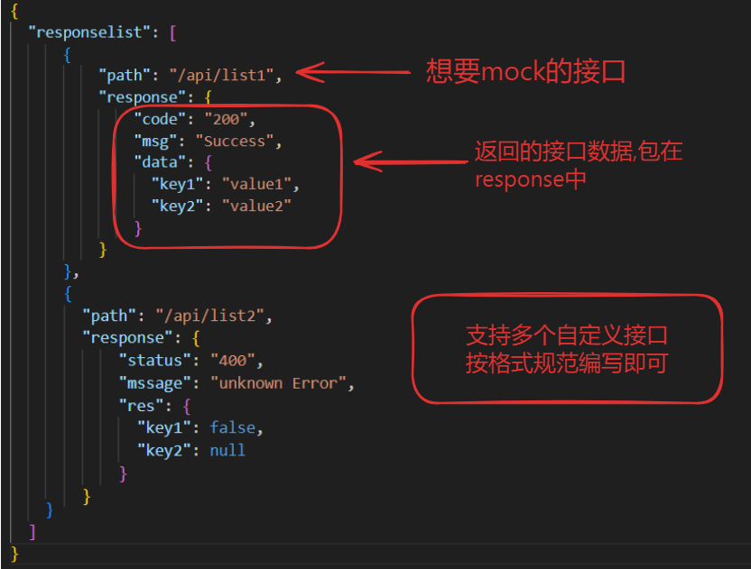

# Mocker-api
<p align="center">
	<strong>🍬使用python编写的一款简易httpserver工具</strong>
</p>

## 📚 简介

Mocker-api是一款基于python开发的mock后台api的服务,支持自定义接口,自定义返回接口数据,支持get及post接口。支持定义多个mock接口,三分钟即可快速配置使用。无需另外下载依赖包。

基于 https://hellogithub.com/onefile/code/96c0137112cf4d15af8008f99d793a1a 项目修改而来

## 🚀 快速启动
在开始之前，请确保您的开发环境满足python3+即可

### 🖊 修改
修改当前目录下的server.json文件中的参数,如下图


### 🤖 部署
- bash命令部署
  - 当前目录下执行如下命令启动服务
    ```bash
    sh start.sh
    ```
  - 执行如下命令停用服务
    ```bash
    sh stop.sh
    ```

- docker命令部署(同步会有nginx的部署安装,如不需要可修docker-compose.yml 文件)

    ```bash
    docker-compose up -d
    ```


### 🔛 使用
服务启动成功后，在浏览器中访问 http://localhost:3002 使用应用。
首页可在线修改接口返回的参数,无需重启服务器


## 👀 演示图

<table>
    <tr>
        <td></td>
    </tr>
    <tr>
        <td></td>
    </tr>
    <tr>
        <td></td>
    </tr>
    <tr>
        <td></td>
    </tr>
</table>